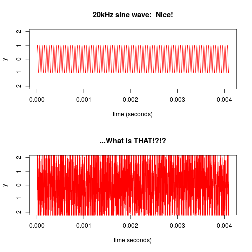

FFT Sliderzzz
========================================================
author: JP
date: 1/24/2015
An interactive frequency domain experience.

Signals
========================================================

 

A different approach
========================================================
Oh, that's much better  
 

Frequency Domain
========================================================
Analyzing a signal in the frequency domain is useful for a variety of tasks, but the concept can be hard to grasp if you've never dealt with it before.
If only there were an interactive application that let's you use a slider to control the frequency of a signal, while adding noise with another slider, and then showing the fourier transform of that signal.  That would make so much sense!

FFT Sliderzzz
========================================================

Well, you're in luck.  FFT Sliderzzz is just such an application.  It has two slider inputs to control signal frequency and noise, and will plot the signal in the time domain, and the frequency domain using a Fast Fourier Transform.
Check it out here:
http://jphaneuf.shinyapps.io/courseraDevelopingDataProducts/
